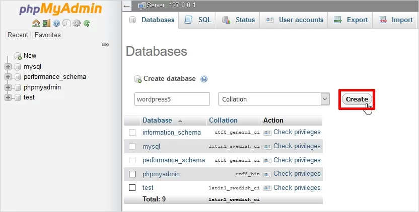
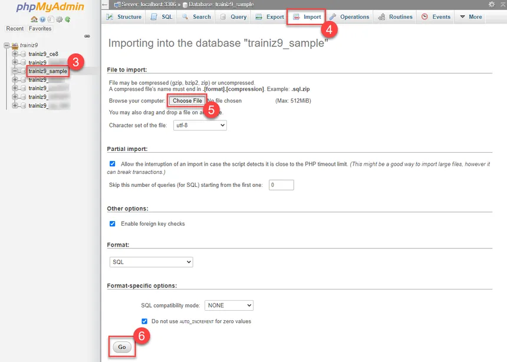

# PHP - MariaDB - Apache

PHP -> http://localhost:7000 -> ./php/index.php

PHPMyAdmin -> http://localhost:7001

## Instalación

* Instalamos Docker Desktop: https://docs.docker.com/desktop/install/windows-install/
* Descargamos e descomprimimos o entorno: https://github.com/DanBaDo/php-mariadb-apache/archive/refs/heads/master.zip
* Abrimos `docker-compose.yml`
* Descargamos o backup da base de datos: https://trello.com/1/cards/668ef2b41e842051ea5b7d6b/attachments/6690052dd4a55b0caca036b7/download/sen-passwords-2022-10-2016-57-45_bbdd.zip
* Accedemos a PHPMyAdmin: http://localhost:7001
* Creamos unha nova base de datos:

* Importamos as taboas desde o backup:

* Analizamos o contido das táboas.
* Modificamos o código en `./php/index.php` para tentar recuperar a información necesaria para reconstruir as novas.
* Accedemos a http://localhost:7000 para ver o resultado.